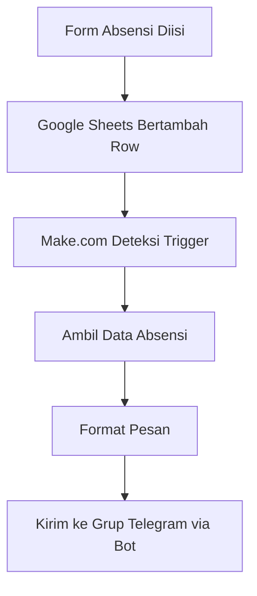
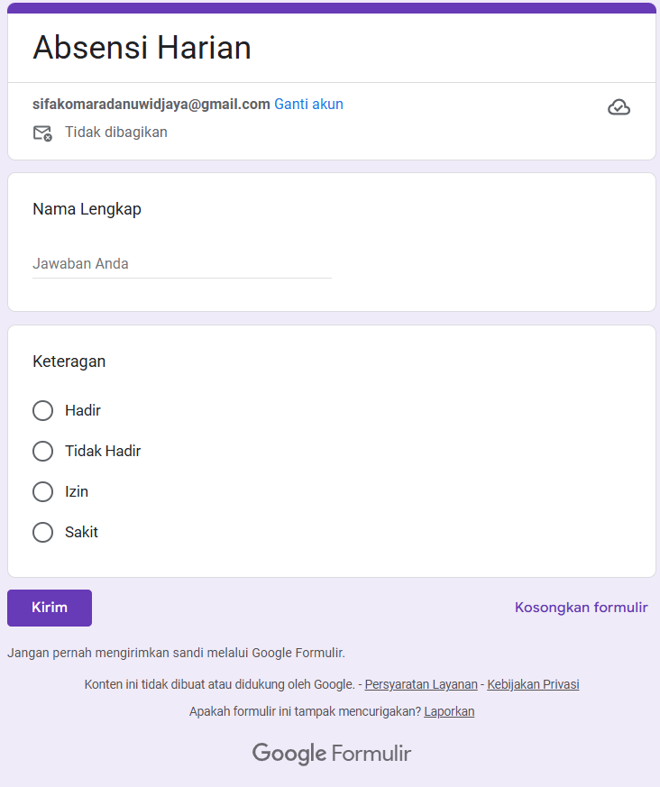
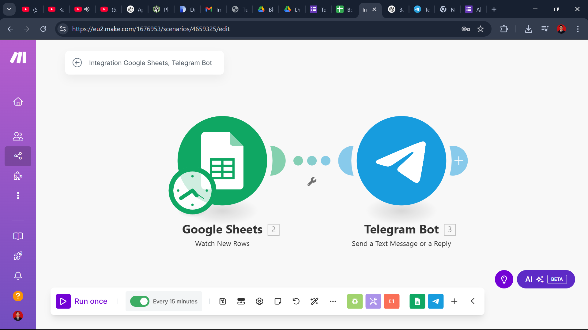
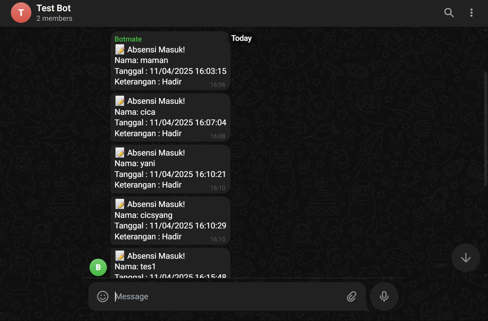

# 🧾 Absensi Online & Notifikasi Otomatis via Telegram

## 📌 Deskripsi Singkat
Sistem ini dibuat untuk mengotomatiskan proses absensi harian dengan mengirimkan notifikasi ke grup Telegram setiap kali form absensi diisi oleh karyawan.

## 🎯 Tujuan Project
- Mempercepat proses pengecekan kehadiran.
- Mengurangi beban admin untuk monitoring manual.
- Meningkatkan transparansi dan komunikasi tim.

## 🛠️ Tools yang Digunakan

| Tools         | Fungsi                                  |
|---------------|------------------------------------------|
| Google Forms  | Input data absensi                       |
| Google Sheets | Menyimpan data absensi                   |
| Make.com      | Otomasi integrasi dan alur kerja         |
| Telegram      | Media notifikasi ke grup                 |
| Telegram Bot  | Pengirim pesan otomatis dari sistem      |

## 🔄 Alur Kerja (Workflow)



## ⚙️ Langkah Implementasi di Make.com

### 1. Siapkan Google Form + Sheet
- Buat Form dengan input: Nama, Waktu Hadir, Keterangan
- Pastikan data masuk ke Google Sheets

### 2. Buat Bot Telegram
- Gunakan @BotFather → Buat bot baru → Salin token
- Tambahkan bot ke grup Telegram → Jadikan admin

### 3. Buat Scenario di Make.com
- **Module 1:** Google Sheets – Watch Rows
- **Module 2:** (Optional) Formatter
- **Module 3:** Telegram Bot – Send a Message

### 4. Aktifkan Skenario
- Klik **ON**
- Atur **schedule (misal: setiap 15 menit)**

## 🧾 Contoh Pesan yang Dikirim

```
📌 Absensi Baru Terkirim!
👤 Nama: Syifa Komara D.
🕘 Waktu Hadir: 08:45 WIB
📝 Keterangan: Hadir

#Absensi #DailyUpdate
```

## 👩‍💻 Skill yang Dipelajari
- Konsep automation & workflow logic
- Mengintegrasikan API sederhana (Telegram Bot)
- Membaca dan memproses data dari Google Sheets
- Logging dan debugging alur otomatisasi

## 🗺️ Roadmap Pengembangan

| Tahap | Fitur Tambahan                                      | Status   |
|-------|-----------------------------------------------------|----------|
| V1    | Absensi + Notifikasi Telegram                       | ✅ Done  |
| V2    | Reminder jika belum absen sampai jam 09.00          | ⏳ Coming |
| V3    | Auto Rekap Absensi Mingguan (PDF + Email)           | ⏳ Coming |
| V4    | Integrasi ke Dashboard Notion / Google DataStudio   | ⏳ Coming |

## 📷 Tangkapan Layar (Screenshots)

### 📄 Google Form


### 📊 Spreadsheet Google Sheets


### 🔧 Make.com Scenario


### 💬 Output Telegram


---

**Author:** Syifa Komara Danuwidjaya  
_Ini adalah salah satu project portfolio automation sederhana menggunakan Make.com. Untuk kolaborasi atau pertanyaan, silakan hubungi saya._
